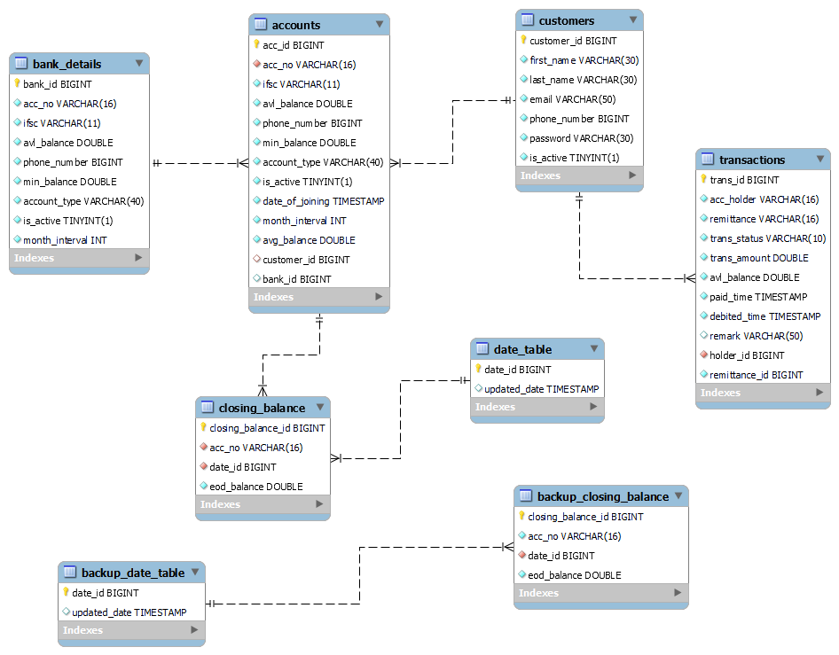

# sec_c_dharunraj.alagaruppu__corejava_project_2

  

## Problem Statement

This project aim is to address a real-time issue that affects all customers with existing bank accounts, particularly those who have savings and current accounts in major public and private banks. In today's world, it is common for individuals to hold at least one or two bank accounts, and most of these accounts require customers to maintain a Monthly Average Minimum Balance (MAB).Failure to maintain the MAB results in customers being fined, albeit by small amounts.From an individual perspective, these fines may seem insignificant, but from the bank's overall perspective, they accumulate into a substantial amount.

## Market Research

 According to 2020 statistics, both public and private sector banks in India collectively accrued more than 35,530 crores in penalties from customers due to non-compliance with MAB requirements.

## Solution

This project stands out from existing UPI apps as it allows customers to link their bank accounts to my application. Once linked, customers can transfer money to other accounts within the application. In every transaction, I check the customers monthly minimum balance, and if the sent amount exceeds this minimum balance, It notify the user before proceeding with the transaction. This ensures that customers maintain their monthly minimum balance properly.

## GitHub Issue - Milestone - 1:
Link to GitHub Issue: [Milestone -1 GitHub Issue](https://github.com/fssa-batch3/sec_c_dharunraj.alagaruppu__corejava_project_2/issues)

## Code Quality Analysis

We have integrated our project with SonarCloud to perform code quality analysis and static code analysis. You can find the overall analysis report on the SonarCloud platform:

- [SonarCloud Analysis](https://sonarcloud.io/summary/new_code?id=fssa-batch3_sec_c_dharunraj.alagaruppu__corejava_project_2)

## Table of Contents

1. [Customers Table](#customers-table)
2. [Accounts Table](#accounts-table)
3. [Transactions Table](#transactions-table)
4.[Bank Details Table](#bank-details-table)

## Milestone -1 

### Customers Table

This table is used to store information about customers.

### Table Schema

| Column Name   | Data Type     | Constraints         | Description                                 |
| ------------- | ------------- | ------------------- | ------------------------------------------- |
| `customer_id` | BIGINT        | AUTO_INCREMENT, PRIMARY KEY | Unique identifier for each customer. |
| `first_name`  | VARCHAR(30)   | NOT NULL            | First name of the customer.                 |
| `last_name`   | VARCHAR(30)   | NOT NULL            | Last name of the customer.                  |
| `email`       | VARCHAR(50)   | NOT NULL            | Email address of the customer.              |
| `phone_number`| BIGINT        | NOT NULL, UNIQUE    | Phone number of the customer.               |
| `password`    | VARCHAR(30)   | NOT NULL            | Password for customer authentication.       |
| `is_active`   | BOOLEAN       | NOT NULL, DEFAULT TRUE | Indicates whether the customer is active. |

## Milestone -2

### Accounts Table

This table is used to store information about bank accounts.

### Table Schema

| Column Name        | Data Type     | Constraints                                         | Description                                    |
| -------------------| ------------- | --------------------------------------------------- | ---------------------------------------------- |
| `acc_id`           | BIGINT        | AUTO_INCREMENT, PRIMARY KEY                         | Unique identifier for each bank account.       |
| `acc_no`           | VARCHAR(16)   | NOT NULL, UNIQUE                                    | Bank account number.                           |
| `ifsc`             | VARCHAR(11)   | NOT NULL                                            | Indian Financial System Code (IFSC).          |
| `avl_balance`      | DOUBLE        | NOT NULL                                            | Available balance in the account.              |
| `phone_number`     | BIGINT        | NOT NULL                                            | Phone number associated with the account.      |
| `min_balance`      | DOUBLE        | NOT NULL                                            | Minimum balance required for the account.      |
| `account_type`     | VARCHAR(40)   | NOT NULL                                            | Type of bank account.                          |
| `is_active`        | BOOLEAN       | NOT NULL, DEFAULT TRUE                             | Indicates whether the account is active.       |
| `date_of_joining`  | TIMESTAMP     | DEFAULT CURRENT_TIMESTAMP ON UPDATE CURRENT_TIMESTAMP NOT NULL | Date of joining the bank.           |
| `month_interval`   | INT           | NOT NULL                                            | Interval for monthly account maintenance.       |
| `avg_balance`      | DOUBLE        | NOT NULL, DEFAULT 0                                 | Average balance in the account.                |
| `customer_id`      | BIGINT        |                                                    | Foreign key referencing the customer.           |
| `bank_id`          | BIGINT        |                                                    | Foreign key referencing the bank details.      |

## Milestone -3

### Transactions Table

This table is used to store information about financial transactions.

### Table Schema

| Column Name     | Data Type     | Constraints                                         | Description                                    |
| ----------------| ------------- | --------------------------------------------------- | ---------------------------------------------- |
| `trans_id`      | BIGINT        | AUTO_INCREMENT, PRIMARY KEY                         | Unique identifier for each transaction.        |
| `acc_holder`    | VARCHAR(16)   | NOT NULL                                            | Account holder's name.                         |
| `remittance`    | VARCHAR(16)   | NOT NULL                                            | Recipient or remittance details.               |
| `trans_status`  | VARCHAR(10)   | NOT NULL                                            | Transaction status (e.g., "completed").        |
| `trans_amount`  | DOUBLE        | NOT NULL                                            | Transaction amount.                             |
| `avl_balance`   | DOUBLE        | NOT NULL                                            | Available balance after the transaction.       |
| `paid_time`     | TIMESTAMP     | DEFAULT CURRENT_TIMESTAMP NOT NULL                 | Timestamp when the transaction was paid.       |
| `debited_time`  | TIMESTAMP     | DEFAULT CURRENT_TIMESTAMP NOT NULL                 | Timestamp when the account was debited.        |
| `remark`        | VARCHAR(50)   | NULL                                                | Optional remark or note for the transaction.   |
| `holder_id`     | BIGINT        | NOT NULL                                           | Foreign key referencing the customer.          |
| `remittance_id` | BIGINT        | NOT NULL                                           | Foreign key referencing the remittance details. |
